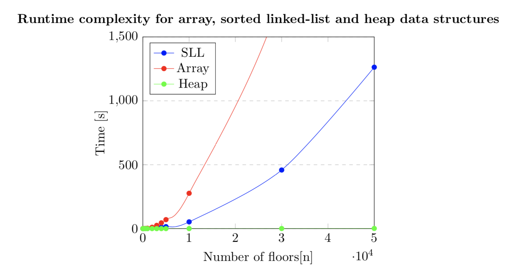

# Elevator-

The elevator issue is when demand for the elevator increases to too many people causing delays. What this project aimed to do was to attempt to solve this problem using a **simple unsorted array, a priority queue implemented using a singly linked-list and lastly using a heap data structure**.

For the unsorted array we expect the worst running time as the worst case would be O(n), whereas the sorted singly linked-list is expected to run in an average time of O(n) and O(lgn), therefore it should be better than the unsorted array. Finally the heap implementation should give the best time of O(lgn).

To ensure a fair comparisons between the 3 data structures, the seed used to generate the random numbers for all three structures was kept constant. With varying the number of floors the elevator is being called too. The results are shown in the plot below.

